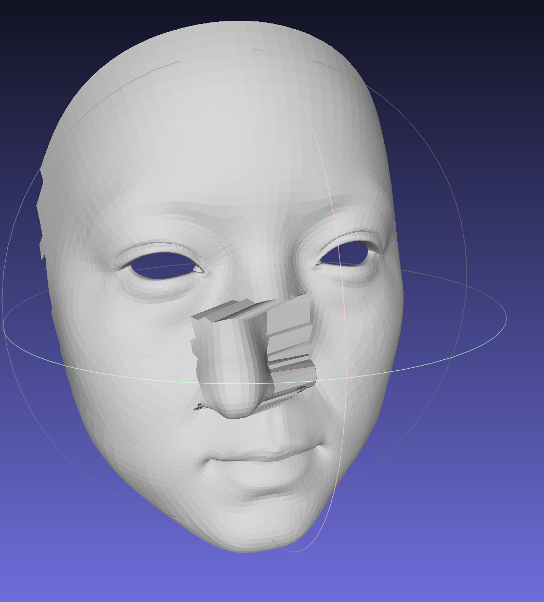
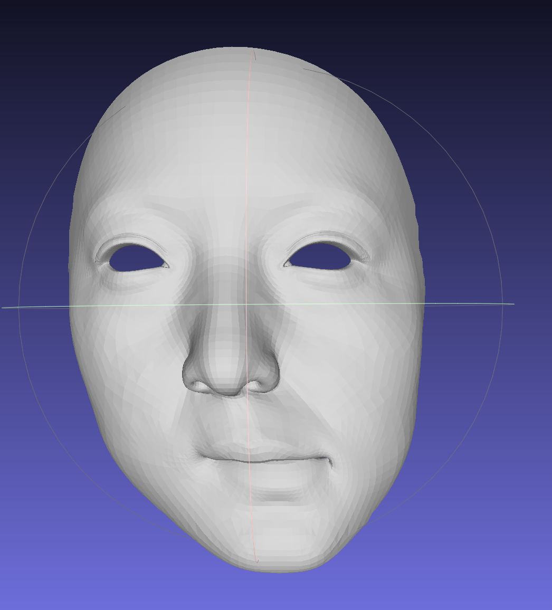
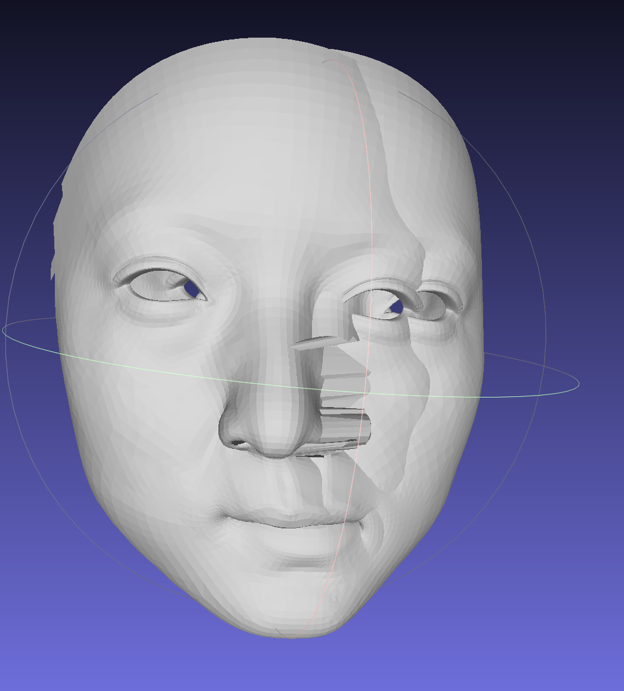

## Abstract
Implemention of "Laplacian Mesh Deformation". 
Reference to [this work](https://github.com/SecretMG/Laplacian-Mesh-Deformation)

## Change
Retain the part of interacting with Blender.
Modify some code to eliminate the dependency on library `S3DGLPy`.
The result remains the same.

## Results
Using mean weight:

Apparently, the locations of anchors don't change. The rest of the human face struggles to fit the 
displaced nose while causing distortions in the face.